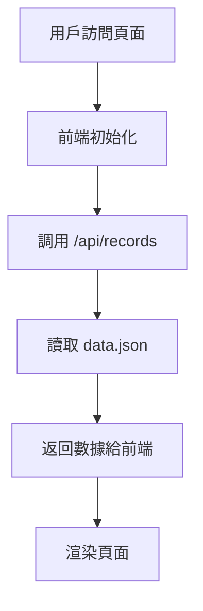
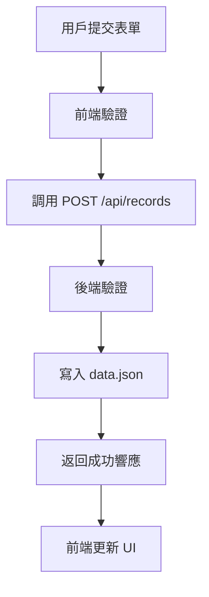
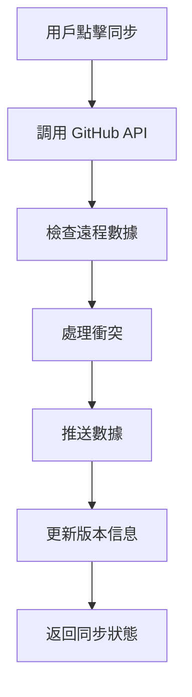

# 家庭財務管理系統 - 系統架構說明

## 📋 目錄
- [系統概述](#系統概述)
- [技術架構](#技術架構)
- [目錄結構](#目錄結構)
- [核心模組](#核心模組)
- [數據流程](#數據流程)
- [部署架構](#部署架構)
- [安全機制](#安全機制)
- [性能優化](#性能優化)

## 🎯 系統概述

家庭財務管理系統是一個基於 Node.js 和前端技術的 Web 應用程式，提供家庭財務記錄、統計分析、數據同步等功能。系統採用前後端分離架構，支援多種查詢方式和數據管理功能。

### 主要功能
- 📊 財務記錄管理（收入/支出）
- 📈 統計分析和報表
- 📅 日期區間查詢
- 👥 成員收支統計
- 📱 響應式設計
- 🔄 GitHub 數據同步
- 📤 Excel 匯入匯出

## 🏗️ 技術架構

### 前端技術棧
```
├── HTML5 (語義化標籤)
├── CSS3 (Flexbox/Grid 佈局)
├── JavaScript ES6+ (原生 JS)
├── 響應式設計 (Mobile First)
└── Progressive Web App 特性
```

### 後端技術棧
```
├── Node.js (Runtime)
├── Express.js (Web Framework)
├── JSON 文件存儲 (數據持久化)
├── GitHub API (數據同步)
└── Multer (文件上傳)
```

### 開發工具
```
├── Git (版本控制)
├── GitHub (代碼託管)
├── Render (雲端部署)
├── npm (包管理)
└── ESLint (代碼檢查)
```

## 📁 目錄結構

```
familyCost/
├── app/                          # 應用程式核心目錄
│   ├── backend/                  # 後端服務
│   │   ├── server.js            # 主服務器文件
│   │   ├── database.js          # 數據庫操作
│   │   ├── github_data_manager.js # GitHub 數據管理
│   │   ├── github_token_manager.js # GitHub Token 管理
│   │   └── token_manager.js     # Token 管理
│   ├── frontend/                 # 前端文件
│   │   ├── index.html           # 主頁面
│   │   ├── script.js            # 前端邏輯
│   │   └── styles.css           # 樣式文件
│   └── config/                   # 配置目錄
│       └── config.js            # 環境配置
├── data/                         # 數據目錄
│   ├── data.json                # 主要數據文件
│   └── version.json             # 版本信息
├── scripts/                      # 腳本目錄
│   ├── start_local.sh           # 本地啟動腳本
│   ├── start_services.sh        # 服務啟動腳本
│   └── update-version.js        # 版本更新腳本
├── docs/                         # 文檔目錄
│   ├── ARCHITECTURE.md          # 系統架構說明
│   ├── API.md                   # API 接口文檔
│   ├── USER_GUIDE.md            # 用戶使用指南
│   └── DEVELOPMENT.md           # 開發者指南
├── uploads/                      # 文件上傳目錄
├── package.json                  # 項目配置
├── render.yaml                   # 部署配置
└── README.md                     # 項目說明
```

## 🔧 核心模組

### 1. 前端模組 (app/frontend/)

#### index.html - 主頁面結構
```javascript
// 主要功能區域
├── 導航欄 (總覽/列表/日曆/新增/設定)
├── 查詢選擇器 (月份查詢/日期區間)
├── 統計展示區 (支出統計/成員統計)
├── 記錄查看區 (篩選/排序/分頁)
└── 表單區域 (新增/編輯記錄)
```

#### script.js - 前端邏輯
```javascript
// 核心功能模組
├── 數據管理 (records, 篩選, 排序)
├── UI 控制 (標籤切換, 表單驗證)
├── 統計計算 (收支統計, 成員統計)
├── 查詢功能 (月份查詢, 日期區間)
├── 文件處理 (Excel 匯入匯出)
└── GitHub 同步 (數據備份)
```

#### styles.css - 樣式設計
```css
/* 響應式設計 */
├── 桌面版樣式 (1200px+)
├── 平板版樣式 (768px-1199px)
├── 手機版樣式 (480px-767px)
├── 小螢幕樣式 (<480px)
└── 組件樣式 (按鈕, 表單, 卡片)
```

### 2. 後端模組 (app/backend/)

#### server.js - 主服務器
```javascript
// API 端點
├── GET /api/records           # 獲取記錄
├── POST /api/records          # 新增記錄
├── PUT /api/records/:id       # 更新記錄
├── DELETE /api/records/:id    # 刪除記錄
├── POST /api/records/clear    # 清空記錄
├── POST /api/upload           # 文件上傳
└── GET /api/version           # 版本信息
```

#### database.js - 數據庫操作
```javascript
// 數據操作功能
├── 讀取 JSON 數據
├── 寫入 JSON 數據
├── 數據備份
├── 數據還原
└── 數據驗證
```

#### github_data_manager.js - GitHub 數據管理
```javascript
// GitHub API 功能
├── 讀取 GitHub 數據
├── 寫入 GitHub 數據
├── 提交歷史管理
├── 衝突處理
└── 錯誤處理
```

### 3. 配置模組 (app/config/)

#### config.js - 環境配置
```javascript
// 環境配置
├── 開發環境 (localhost)
├── 測試環境 (SIT)
├── 生產環境 (Render)
├── API 端點配置
└── GitHub 配置
```

## 🔄 數據流程

### 1. 數據讀取流程


### 2. 數據寫入流程


### 3. GitHub 同步流程


## 🚀 部署架構

### 本地開發環境
```
開發者機器
├── Node.js 環境
├── Git 版本控制
├── 本地服務器 (localhost:3000)
└── 數據文件 (data/data.json)
```

### 生產環境 (Render)
```
Render 雲端平台
├── Node.js 運行環境
├── 自動部署 (GitHub 推送觸發)
├── 環境變量管理
├── 持久化存儲
└── HTTPS 證書
```

### 數據同步架構
```
本地數據 ←→ GitHub Repository ←→ Render 生產環境
    ↓              ↓                    ↓
data.json    familyCost/data.json   Render 數據存儲
```

## 🔒 安全機制

### 1. 數據安全
- JSON 文件本地存儲
- GitHub Token 環境變量管理
- 數據備份機制
- 輸入驗證和清理

### 2. API 安全
- 請求參數驗證
- 錯誤處理機制
- 日誌記錄
- 跨域請求控制

### 3. 前端安全
- XSS 防護
- 輸入驗證
- 安全的 DOM 操作
- 錯誤邊界處理

## ⚡ 性能優化

### 1. 前端優化
- 響應式圖片載入
- CSS/JS 文件壓縮
- 本地存儲緩存
- 延遲載入

### 2. 後端優化
- JSON 文件讀寫優化
- API 響應緩存
- 錯誤處理優化
- 日誌管理

### 3. 數據優化
- 增量數據更新
- 數據分頁載入
- 查詢索引優化
- 備份策略

## 📊 監控和維護

### 1. 版本管理
- Git 版本控制
- 自動版本號更新
- 發布日誌記錄
- 回滾機制

### 2. 錯誤監控
- 前端錯誤捕獲
- 後端日誌記錄
- 用戶反饋收集
- 性能監控

### 3. 數據維護
- 定期數據備份
- 數據清理策略
- 存儲空間監控
- 數據遷移計劃

## 🔮 未來擴展

### 1. 功能擴展
- 多語言支援
- 主題切換
- 高級報表
- 數據分析

### 2. 技術升級
- 數據庫遷移
- 微服務架構
- 容器化部署
- CI/CD 流程

### 3. 平台擴展
- 移動應用
- 桌面應用
- 瀏覽器擴展
- API 開放

---

*最後更新：2025-10-07*
*版本：1.0.0*
